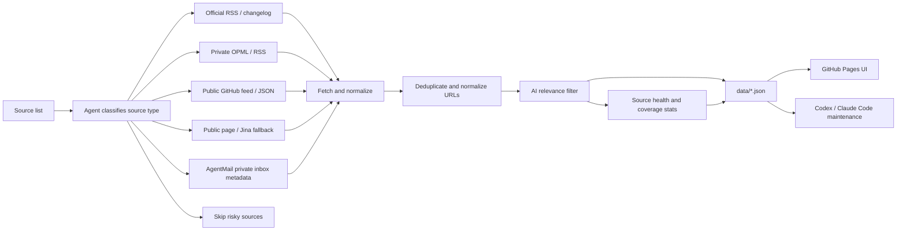

<div align="center">

# AI News Radar

## Source-Savvy Agent Skill

**A serverless AI news signal board that knows how to handle your sources.**

[](https://learnprompt.github.io/ai-news-radar/)
[](https://github.com/LearnPrompt/ai-news-radar/actions/workflows/update-news.yml)
[](LICENSE)

Read the signal. Let the agent decide how each source should enter the radar.

[Live site](https://learnprompt.github.io/ai-news-radar/) · [中文](README.md) · [Agent Skill](skills/ai-news-radar/SKILL.md) · [Source strategy](docs/SOURCE_COVERAGE.md)

</div>

---

## What is this?

AI News Radar is an auto-updating AI news signal board.

Readers open the hosted page and scan the last 24 hours of AI, model, developer-tool, and tech-ecosystem updates. Maintainers can fork the repo and add their own OPML/RSS files, public feeds, static pages, or optional AgentMail inbox metadata. Codex, Claude Code, and other coding agents can use the in-repo skill to keep source intake, source strategy, and Pages deployment maintainable.

The Chinese-facing package name is **懂王.skill**. It is a memorable name for the source-intake agent, not a claim that the system knows everything. Its job is narrow: turn messy sources into a readable AI daily radar.

> This public repo does not include private RSS subscription files, API keys, cookies, email bodies, or credentials.

## Why this exists

Good updates are scattered. Bad signals are endless.

Official blogs publish some updates. GitHub changelogs publish others. Builders share early signals on X. Aggregator sites re-post the same story again and again. The real work is no longer opening one more website. The real work is deciding which sources are worth tracking, which ones are stable, which ones are duplicates, and which ones should stay private.

AI News Radar handles that first layer.

It classifies sources, fetches public data, normalizes items, deduplicates repeated stories, filters for AI-relevant signals, tracks source health, and publishes a static web UI. The default layer stays simple for ordinary readers. The advanced layer is for maintainers and agents who want OPML, custom feeds, GitHub Actions secrets, and optional private integrations.

## Live site

- Live page: `https://learnprompt.github.io/ai-news-radar/`
- GitHub repo: `https://github.com/LearnPrompt/ai-news-radar`

Use the web page for daily reading. GitHub Actions updates `data/*.json` every 30 minutes, and GitHub Pages serves the latest UI.

## Current features

- Built-in official AI sources: OpenAI News, OpenAI Codex Changelog, OpenAI Skills, Anthropic, Google DeepMind, Google AI, Hugging Face, GitHub AI, and more
- High-signal public newsletter coverage, such as AI Breakfast
- Public generated builder feeds, such as Follow Builders for X builders, Anthropic Engineering, Claude Blog, and AI podcasts
- Public aggregator sources for broader coverage
- OPML/RSS ingestion for private source lists, with `feeds/follow.opml` kept out of git
- Optional AgentMail inbox intelligence, disabled by default and limited to metadata-only output
- 24h two-view UI: `AI-focused` and `All`
- Deduplication by default in AI-focused mode, plus a dedup toggle for All mode
- Coverage radar for source health, source pool, AI-selected items, official/newsletter coverage, Builders/X coverage, and private extension readiness
- Bilingual title rendering and site grouping
- WaytoAGI latest-day / last-7-days updates
- Alert-friendly status output: `failed_feeds`, `zero_item_feeds`, `skipped_feeds`, and `replaced_feeds`

## How it works



The useful pattern is not “add as many sources as possible”. The useful pattern is a stable news pipeline: source intake, fetch, dedupe, filter, status output, and static publishing.

AI News Radar keeps the default path lightweight. It does not require an LLM API key, cookies, logged-in browsers, X API access, or email bodies for the public version. Those belong in the advanced layer and must be configured through environment variables or GitHub Secrets.

## Compared with heavier AI news digest systems

Projects such as Horizon show a broader version of the AI news pipeline: multi-source fetch, AI scoring, deduplication, background enrichment, community-comment summaries, bilingual digests, GitHub Pages publishing, email delivery, webhooks, and MCP tools.

AI News Radar can learn from that product language, but its current scope is intentionally narrower.

This repo is a **serverless signal board plus source-intake agent skill**. It focuses on 24h signals, source health, public defaults, forkability, and safe private extensions. It does not currently promise full LLM-generated long summaries, comment-thread summarization, mailing-list delivery, webhook delivery, or MCP tooling.

Those can be future modules, but they should not be documented as shipped features until implemented.

## Quick start

Readers do not need to install anything. Open the live site.

To run your own copy locally:

```bash
git clone https://github.com/LearnPrompt/ai-news-radar.git
cd ai-news-radar
python3 -m venv .venv
source .venv/bin/activate
pip install -r requirements.txt
python scripts/update_news.py --output-dir data --window-hours 24
python -m http.server 8080
```

Open:

```text
http://localhost:8080
```

To use your own OPML:

```bash
cp feeds/follow.example.opml feeds/follow.opml
# Replace with your own subscriptions. Do not commit this file.
python scripts/update_news.py --output-dir data --window-hours 24 --rss-opml feeds/follow.opml
```

## First prompt for an agent

If you want Codex or Claude Code to help you build your own radar, start with:

```text
Use the AI News Radar skill. Ask me for my source list first, then classify each source as RSS, OPML, public feed, static page, Jina fallback, AgentMail private inbox, or skipped. The goal is a serverless AI daily radar that updates with GitHub Actions and deploys to GitHub Pages. Do not commit API keys, cookies, tokens, private OPML files, email addresses, email bodies, or credentials.
```

The in-repo skill lives at:

- `skills/ai-news-radar/README.md`
- `skills/ai-news-radar/SKILL.md`

For handoff, read:

- `README.md`
- `README.en.md`
- `docs/GPT_HANDOFF.md`
- `docs/SOURCE_COVERAGE.md`
- `docs/V2_PRODUCT_BRIEF.md`

## GitHub Actions updates

`.github/workflows/update-news.yml` is already configured.

- Runs every 30 minutes
- Generates and commits `data/*.json`
- Decodes `FOLLOW_OPML_B64` into `feeds/follow.opml` if configured
- Generates AgentMail metadata only when `EMAIL_DIGEST_ENABLED=1`, `AGENTMAIL_API_KEY`, and `AGENTMAIL_INBOX_ID` are set
- Commits `data/email-digest.json` only when `EMAIL_DIGEST_PUBLISH=1` is explicitly set

By default, the core pipeline requires no API keys.

## Output files

- `data/latest-24h.json`
- `data/latest-24h-all.json`
- `data/archive.json`
- `data/source-status.json`
- `data/waytoagi-7d.json`
- `data/title-zh-cache.json`
- `data/email-digest.json`, optional and not published by default

## Safety boundaries

- Do not commit `feeds/follow.opml`
- Do not commit API keys, cookies, tokens, `.env`, inbox addresses, email bodies, or raw emails
- Treat X API, WeChat, private newsletters, and login-bound websites as advanced/private integrations, not public defaults
- Keep AgentMail disabled by default and metadata-only when enabled
- Keep the public repo runnable with public sources, GitHub Actions, and GitHub Pages

## Validation

```bash
python -m py_compile scripts/update_news.py
pytest -q
node --check assets/app.js
git diff --check
```

If the skill changes:

```bash
python "${CODEX_HOME:-$HOME/.codex}/skills/.system/skill-creator/scripts/quick_validate.py" skills/ai-news-radar
```

## License

[MIT](LICENSE)
